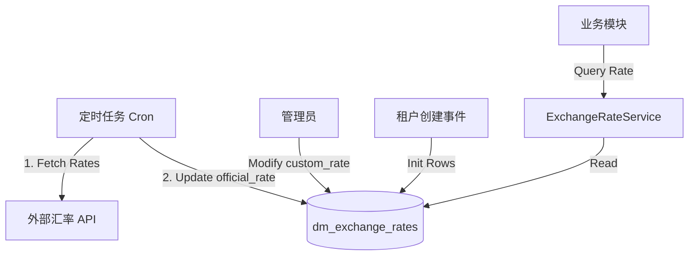

# 多币种实时汇率模块设计方案

## 1. 需求背景

为满足海外业务需求，系统需要支持多币种实时汇率管理。基础货币固定为人民币 (CNY)。
系统需支持：
1.  自动为新租户创建多币种汇率信息。
2.  每日自动从外部 API 更新官方汇率 (Official Rate)。
3.  允许用户设置自定义汇率 (Custom Rate)，业务计算时优先使用。

## 2. 数据库设计

### 2.1 币种字典表 (`system_currency`)
*   **库**: `yudao-cloud`
*   **用途**: 全局维护的所有支持币种的字典。
*   **结构**:
    *   `id`: 主键
    *   `currency_code`: 货币代码 (ISO 4217, 如 USD, EUR, JPY)
    *   `name`: 货币名称
    *   `symbol`: 符号
    *   `status`: 状态 (开启/禁用)

### 2.2 租户汇率表 (`dm_exchange_rates`)
*   **库**: `maipro-base`
*   **用途**: 存储每个租户的汇率数据。
*   **结构**:
    *   `id`: 主键
    *   `tenant_id`: 租户ID (隔离不同租户的配置)
    *   `currency_code`: 目标货币代码 (关联 `system_currency.currency_code`)
    *   `official_rate`: 官方汇率 (外部API更新，基准: 1外币 = X人民币，保留4位小数)
    *   `custom_rate`: 自定义汇率 (用户手动设置，业务优先使用，保留4位小数)
    *   `base_currency`: **[已废弃]**
    *   `target_currency`: **[已废弃]**
    *   `update_time`: 更新时间


## 3. 核心流程设计

### 3.1 币种字典 (`system_currency`) 的必要性说明
虽然核心业务主要消耗 `dm_exchange_rates`，但 `system_currency` 仍然**非常必要**：
1.  **标准化**: 统一货币名称（如 "US Dollar"）、符号（"$"）、小数位精度等展现层元数据，避免各处硬编码。
2.  **开关控制**: 系统可能支持100种货币，但当前业务只开放 5 种。通过 `system_currency.status` 可以全局控制下拉框选项。
3.  **数据完整性**: 作为外键约束或逻辑校验的基础，防止出现不存在的币种代码。

### 3.2 租户初始化 (Tenant Creation)
*   **触发**: 监听租户创建事件 (`TenantCreateEvent`) 或在租户服务创建逻辑中嵌入。
*   **逻辑**:
    1.  查询 `system_currency` 获取所有启用状态的币种。
    2.  **获取实时汇率**: 调用汇率 API (`/v1/latest`) 获取当前启用的各币种实时汇率。
    3.  **插入初始记录**: 遍历币种，为新租户在 `dm_exchange_rates` 表中插入记录。
        *   将获取到的实时汇率值**同时**赋值给 `official_rate` 和 `custom_rate` (确保初始数据即为最新且可用)。
        *   若 API 调用失败，则 fallback 使用默认值 (如 1.0) 并记录异常日志，由定时任务后续修正。

### 3.2 每日汇率更新 (Cron Job)
*   **调度**: 每日凌晨 00:00 执行。
*   **数据源**: **Private Currency API**。
    *   **URL**: `http://1.117.17.136:9800/v1/latest`
    *   **参数**:
        *   `base`: 固定为 `cny`。
        *   `symbols`: 需查询的货币代码列表 (逗号分隔)，来源于 `system_currency` 表中启用的币种 (如 `USD,KRW,JPY`)。
        *   *Example*: `http://1.117.17.136:9800/v1/latest?base=cny&symbols=USD,KRW,JPY`
*   **逻辑**:
    1.  调用 API 获取以 CNY 为基准的汇率列表。
        *   **API 返回示例**:
            ```json
            {
              "amount": 1.0,
              "base": "CNY",
              "date": "2026-01-02",
              "rates": {
                "USD": 0.14299,
                "JPY": 22.439,
                "KRW": 206.6
              }
            }
            ```
        *   **含义**: API 返回的是 **由于API限制，只能获取 CNY -> Foreign** (即 1 CNY = 0.14 USD)。
        *   **转换逻辑**: 我们的系统采用 **直接标价法** (1 外币 = XX 人民币)。
        *   **公式**: `存储汇率 = 1 / API_Rate` (保留 4 位小数，四舍五入)。
        *   *Example*: USD 存储值 = `1 / 0.14299 ≈ 6.9935`。
    2.  遍历所有租户的 `dm_exchange_rates`:
        *   **更新实时表**: 更新 `official_rate`。
        *   *(不再入库历史汇率，历史数据仅通过 API 实时查询)*

### 3.3 汇率获取与计算
*   **接口**: 提供 `ExchangeRateService`。
*   **精度控制**:
    *   数据库字段类型建议: `DECIMAL(15, 4)`。
    *   Java 计算: 使用 `BigDecimal`，并在除法运算时指定 `RoundingMode.HALF_UP`。
*   **前端展示**:
    *   展示如 `1 USD = 7.2254 CNY`。
*   **获取逻辑**:
    *   输入: `sourceCurrency` (外币), `targetCurrency` (CNY)
    *   查询: `dm_exchange_rates` where `tenant_id` = current and `currency_code` = sourceCurrency.
    *   取值优先级:
        1.  `custom_rate` (如果 > 0)
        2.  `official_rate`
*   **前端展示**:
    *   管理后台展示 `官方汇率` 和 `自定义汇率` 两列。
    *   用户编辑仅修改 `custom_rate`。
    *   用户编辑仅修改 `custom_rate`。

### 3.4 历史汇率获取
*   **用途**: 用于实时查询历史汇率走势 (不进行数据库持久化存储)。
*   **API 接口**:
    *   **URL**: `http://1.117.17.136:9800/v1/{start_date}..{end_date}`
    *   **参数**:
        *   `base`: 固定为 `cny`。
        *   `symbols`: 目标币种 (如 `USD,KRW,JPY`)。
    *   *Example*: `http://1.117.17.136:9800/v1/2025-12-01..2026-01-04?base=cny&symbols=USD,KRW,JPY`
*   **API 返回示例**:
    ```json
    {
      "amount": 1.0,
      "base": "CNY",
      "start_date": "2025-12-01",
      "end_date": "2026-01-04",
      "rates": {
        "2025-12-01": {
          "JPY": 21.89,
          "KRW": 207.18,
          "USD": 0.14141
        },
        "2025-12-02": {
          "JPY": 22.072,
          "KRW": 207.59,
          "USD": 0.14142
        }
      }
    }
    ```
*   **处理逻辑**:
    1.  解析返回的 `rates` 对象。
    2.  前端接收到数据后，按日期展示趋势图。
    3.  需注意：展示前需转换为直接标价法 (1 外币 = XX CNY)，公式: `1 / API_Rate`，保留 4 位小数。
## 4. 模块架构



## 5. API 示例 (外部)
假设使用 `http://1.117.17.136:9800/v1/latest?base=cny&symbols=USD,EUR`
Response:
```json
{
  "base": "CNY",
  "date": "2026-01-02",
  "rates": {
    "USD": 0.14299,
    "EUR": 0.12199
  }
}
```
**转换逻辑**:
*   存储 USD 汇率: `1 / 0.14299 ≈ 6.9935` (即 1 USD = 6.99 CNY)

## 6. 后续扩展
*   支持更多免费/付费 API 源的切换 (Strategy Pattern)。
*   增加汇率波动的告警通知。
