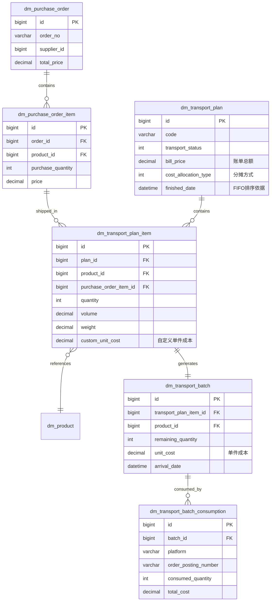
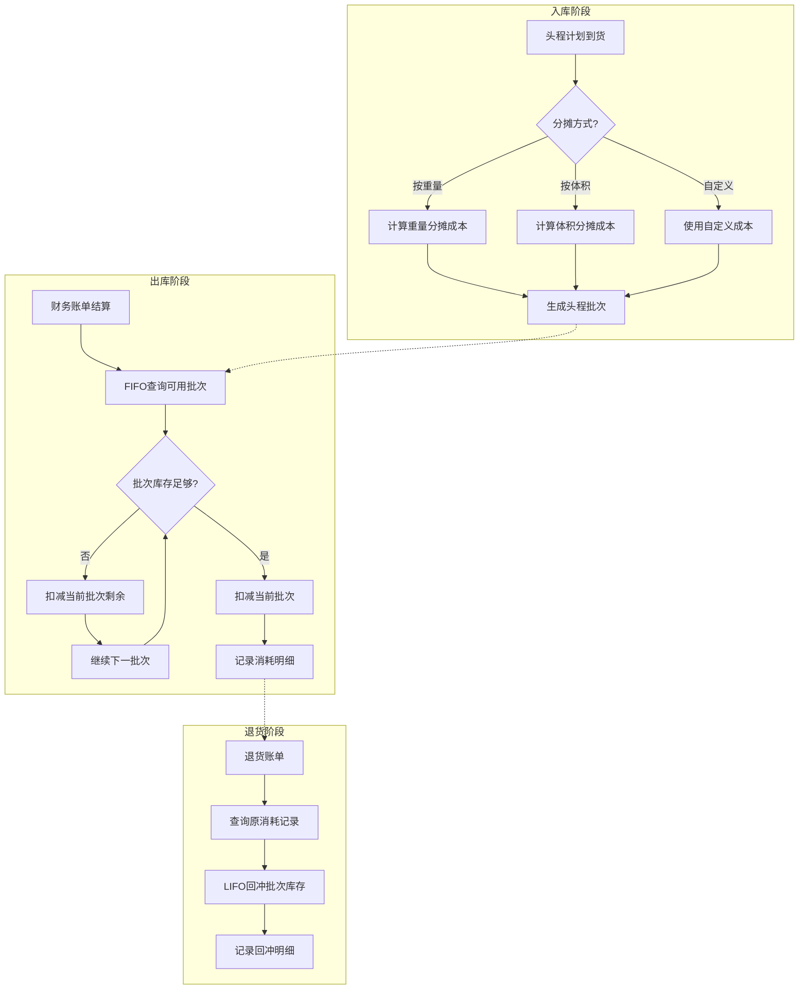

# 头程运费先进先出(FIFO)设计方案

> 版本：v1.2 | 更新日期：2026-01-07

## 一、背景与目标

### 1.1 当前问题

目前系统中头程运费在 `dm_product_costs` 表使用**固定单价**的方式进行成本核算：

```java
// SignedOrderCostCalculator.java 第399-409行
if (productCosts.getLogisticsShippingCost() != null && productPurchase != null) {
    BigDecimal logisticsCost = calculateCostByUnitType(
            productCosts.getLogisticsUnit(),
            productCosts.getLogisticsShippingCost(),  // ← 固定单价
            productPurchase,
            quantity,
            config
    );
    profitReport.setLogisticsShippingCost(logisticsCost.negate());
}
```

**问题**：不同批次的头程运费可能不同（不同货代、不同时期、不同运输方式），使用固定单价无法反映真实的头程成本。

### 1.2 目标

实现头程运费的**先进先出(FIFO)分摊**，使订单的头程成本能够追溯到具体的头程批次，准确反映实际运输成本。

---

## 二、关键决策

| 决策项 | 选择 | 说明 |
| ------ | ---- | ---- |
| 成本分摊方式 | **可配置** | 支持按重量/体积/自定义三种方式 |
| 批次库存不足 | **继续使用后续批次** | 自动使用下一个可用批次填补 |
| 批次生成时机 | **到货自动生成** | 头程计划状态变更为到货时自动生成 |
| 前端展示 | **利润报告展示批次来源** | 用户可查看成本来源批次 |
| 平台接入 | **全部平台** | Ozon/WB/Amazon/Coupang统一接入 |

---

## 三、现有系统分析

### 3.1 多平台订单架构

```
┌─────────────────────────────────────────────────────────────────┐
│                      DM模块 (maipro-base库)                      │
├─────────────────────────────────────────────────────────────────┤
│  ┌─────────────┐  ┌─────────────┐                               │
│  │   Ozon      │  │     WB      │   ← 本库存储                  │
│  │  订单/财务  │  │  订单/财务  │                               │
│  └─────────────┘  └─────────────┘                               │
│                                                                 │
│  ┌─────────────┐  ┌─────────────┐  ┌─────────────┐              │
│  │   采购单    │  │  头程计划   │  │  头程批次   │              │
│  │ (公共模块)  │  │  (公共模块) │  │  (公共模块) │  ← 新增      │
│  └─────────────┘  └─────────────┘  └─────────────┘              │
└─────────────────────────────────────────────────────────────────┘
            │                │                │
            ▼                ▼                ▼
┌─────────────────┐  ┌─────────────────┐  ┌─────────────────┐
│  Amazon模块     │  │  Coupang模块    │  │   其他平台      │
│  (分库分表)     │  │  (分库分表)     │  │   微服务部署    │
│  通过RPC调用    │  │  通过RPC调用    │  │   通过RPC调用   │
└─────────────────┘  └─────────────────┘  └─────────────────┘
```

### 3.2 完整数据关系链路



### 3.3 成本计算触发时机

基于**财务结算账单**触发成本计算：

| 账单类型 | 触发动作 |
| -------- | -------- |
| `type = 'orders'` | 签收成本计算，FIFO扣减批次库存 |
| `type = 'returns'` | 退货成本冲减，LIFO回冲批次库存 |

---

## 四、FIFO设计方案

### 4.1 核心流程



### 4.2 成本分摊配置设计

#### 4.2.1 分摊方式枚举

| 值 | 类型 | 说明 |
| -- | ---- | ---- |
| 10 | 按重量分摊 | 单件成本 = (单件重量/计划总重量) × 账单总额 / 数量 |
| 20 | 按体积分摊 | 单件成本 = (单件体积/计划总体积) × 账单总额 / 数量 |
| 30 | 自定义成本 | 直接读取明细表中设置的 `custom_unit_cost` |

#### 4.2.2 计算公式

**按重量分摊 (type=10)**

```
商品分摊比例 = 商品发运总重量 / 计划总重量
商品分摊金额 = 分摊比例 × 头程账单总额
单件头程成本 = 商品分摊金额 / 商品发运数量
```

**按体积分摊 (type=20)**

```
商品分摊比例 = 商品发运总体积 / 计划总体积
商品分摊金额 = 分摊比例 × 头程账单总额
单件头程成本 = 商品分摊金额 / 商品发运数量
```

**自定义成本 (type=30)**

```
单件头程成本 = dm_transport_plan_item.custom_unit_cost
```

#### 4.2.3 计算示例

**场景**：头程计划包含2个商品，账单总额 10,000 元

| 商品 | 数量 | 单件重量(kg) | 总重量(kg) | 单件体积(m³) | 总体积(m³) |
| ---- | ---- | ------------ | ---------- | ------------ | ---------- |
| A | 100 | 1.0 | 100 | 0.01 | 1.0 |
| B | 400 | 0.5 | 200 | 0.02 | 8.0 |
| 合计 | 500 | - | 300 | - | 9.0 |

**按重量分摊**：

- 商品A：(100/300) × 10,000 / 100 = 33.33 元/件
- 商品B：(200/300) × 10,000 / 400 = 16.67 元/件

**按体积分摊**：

- 商品A：(1.0/9.0) × 10,000 / 100 = 11.11 元/件
- 商品B：(8.0/9.0) × 10,000 / 400 = 22.22 元/件

**自定义成本**：

- 商品A：直接使用设置值，如 30 元/件
- 商品B：直接使用设置值，如 15 元/件

### 4.3 新增表结构

#### 表1：`dm_transport_batch`（头程批次库存表）

```sql
CREATE TABLE `dm_transport_batch` (
  `id` bigint unsigned NOT NULL AUTO_INCREMENT COMMENT '主键',
  `transport_plan_id` bigint NOT NULL COMMENT '头程计划ID',
  `transport_plan_code` varchar(50) DEFAULT NULL COMMENT '头程计划编号（冗余）',
  `transport_plan_item_id` bigint NOT NULL COMMENT '头程计划明细ID',
  `purchase_order_item_id` bigint DEFAULT NULL COMMENT '采购单明细ID（追溯）',
  `product_id` bigint NOT NULL COMMENT '产品ID',
  `initial_quantity` int NOT NULL COMMENT '初始入库数量',
  `remaining_quantity` int NOT NULL COMMENT '剩余可用数量',
  `unit_cost` decimal(10,4) NOT NULL COMMENT '单件头程成本',
  `cost_allocation_type` tinyint NOT NULL COMMENT '分摊方式：10-重量，20-体积，30-自定义',
  `cost_currency` varchar(10) DEFAULT 'CNY' COMMENT '成本币种',
  `arrival_date` datetime NOT NULL COMMENT '入库日期（用于FIFO排序）',
  `status` tinyint DEFAULT 1 COMMENT '状态：1-可用，0-已用尽',
  `create_time` datetime DEFAULT CURRENT_TIMESTAMP,
  `update_time` datetime DEFAULT CURRENT_TIMESTAMP ON UPDATE CURRENT_TIMESTAMP,
  `creator` varchar(64) DEFAULT NULL,
  `updater` varchar(64) DEFAULT NULL,
  `tenant_id` bigint NOT NULL DEFAULT 0,
  `deleted` bit(1) NOT NULL DEFAULT b'0',
  PRIMARY KEY (`id`),
  KEY `idx_product_status_date` (`product_id`, `status`, `arrival_date`),
  KEY `idx_transport_plan` (`transport_plan_id`),
  KEY `idx_transport_plan_item` (`transport_plan_item_id`),
  KEY `idx_purchase_order_item` (`purchase_order_item_id`)
) ENGINE=InnoDB COMMENT='头程批次库存表';
```

#### 表2：`dm_transport_batch_consumption`（头程批次消耗记录表）

```sql
CREATE TABLE `dm_transport_batch_consumption` (
  `id` bigint unsigned NOT NULL AUTO_INCREMENT COMMENT '主键',
  `batch_id` bigint NOT NULL COMMENT '批次ID',
  `platform` varchar(20) NOT NULL COMMENT '平台：OZON/WB/AMAZON/COUPANG',
  `order_posting_number` varchar(50) NOT NULL COMMENT '订单号',
  `order_item_id` bigint DEFAULT NULL COMMENT '订单明细ID',
  `product_id` bigint NOT NULL COMMENT '产品ID',
  `consumed_quantity` int NOT NULL COMMENT '消耗数量（正数消耗，负数回冲）',
  `unit_cost` decimal(10,4) NOT NULL COMMENT '单件成本（冗余）',
  `total_cost` decimal(12,4) NOT NULL COMMENT '总成本',
  `consumption_time` datetime NOT NULL COMMENT '消耗时间',
  `consumption_type` tinyint DEFAULT 1 COMMENT '消耗类型：1-销售出库，2-退货回冲',
  `finance_transaction_id` bigint DEFAULT NULL COMMENT '财务账单ID（追溯）',
  `create_time` datetime DEFAULT CURRENT_TIMESTAMP,
  `creator` varchar(64) DEFAULT NULL,
  `tenant_id` bigint NOT NULL DEFAULT 0,
  `deleted` bit(1) NOT NULL DEFAULT b'0',
  PRIMARY KEY (`id`),
  KEY `idx_order` (`order_posting_number`),
  KEY `idx_batch` (`batch_id`),
  KEY `idx_product` (`product_id`),
  KEY `idx_platform_order` (`platform`, `order_posting_number`)
) ENGINE=InnoDB COMMENT='头程批次消耗记录表';
```

#### 表3：修改 `dm_transport_plan` 表

```sql
ALTER TABLE dm_transport_plan
ADD COLUMN cost_allocation_type tinyint DEFAULT 10 COMMENT '成本分摊方式：10-重量，20-体积，30-自定义';
```

#### 表4：修改 `dm_transport_plan_item` 表

```sql
ALTER TABLE dm_transport_plan_item
ADD COLUMN custom_unit_cost decimal(10,4) DEFAULT NULL COMMENT '自定义单件头程成本';
```

#### 表5：修改 `dm_profit_report` 表

```sql
ALTER TABLE dm_profit_report
ADD COLUMN transport_batch_id bigint DEFAULT NULL COMMENT '主批次ID（多批次时为第一个）',
ADD COLUMN transport_batch_detail json DEFAULT NULL COMMENT '批次消耗明细JSON';
```

**transport_batch_detail JSON格式**：

```json
[
  {
    "batchId": 123,
    "planCode": "TP2026010001",
    "quantity": 5,
    "unitCost": 25.50,
    "totalCost": 127.50
  },
  {
    "batchId": 124,
    "planCode": "TP2026010002",
    "quantity": 3,
    "unitCost": 28.00,
    "totalCost": 84.00
  }
]
```

### 4.4 FIFO分配流程详细设计

#### 4.4.1 查询可用批次

```sql
-- FIFO查询可用批次（按到货时间排序）
SELECT 
    id,
    transport_plan_id,
    transport_plan_code,
    product_id,
    remaining_quantity,
    unit_cost,
    cost_allocation_type,
    arrival_date
FROM dm_transport_batch 
WHERE product_id = #{productId}
  AND status = 1 
  AND remaining_quantity > 0
  AND tenant_id = #{tenantId}
  AND deleted = 0
ORDER BY arrival_date ASC
LIMIT 20;
```

#### 4.4.2 分配算法

```java
/**
 * FIFO分配头程批次
 * 
 * @param productId 产品ID
 * @param requiredQuantity 需求数量
 * @param orderInfo 订单信息
 * @return 批次消耗结果列表
 */
public List<BatchConsumptionResult> allocateFIFO(
        Long productId, 
        int requiredQuantity,
        OrderInfo orderInfo) {
    
    // 1. 查询可用批次（按FIFO排序）
    List<TransportBatch> batches = queryAvailableBatches(productId);
    
    List<BatchConsumptionResult> results = new ArrayList<>();
    int remaining = requiredQuantity;
    
    // 2. 按FIFO顺序分配
    for (TransportBatch batch : batches) {
        if (remaining <= 0) break;
        
        int allocate = Math.min(remaining, batch.getRemainingQuantity());
        BigDecimal totalCost = batch.getUnitCost()
            .multiply(new BigDecimal(allocate));
        
        // 3. 记录消耗
        BatchConsumptionResult result = new BatchConsumptionResult();
        result.setBatchId(batch.getId());
        result.setPlanCode(batch.getTransportPlanCode());
        result.setQuantity(allocate);
        result.setUnitCost(batch.getUnitCost());
        result.setTotalCost(totalCost);
        results.add(result);
        
        // 4. 扣减批次库存
        batch.setRemainingQuantity(batch.getRemainingQuantity() - allocate);
        if (batch.getRemainingQuantity() == 0) {
            batch.setStatus(0); // 标记用尽
        }
        updateBatch(batch);
        
        // 5. 保存消耗记录
        saveConsumption(batch, orderInfo, allocate, totalCost);
        
        remaining -= allocate;
    }
    
    // 6. 批次库存不足时，继续使用后续批次（已在循环中处理）
    // 如果所有批次都用完仍不够，remaining > 0，可记录警告
    if (remaining > 0) {
        log.warn("产品{}批次库存不足，缺少{}件", productId, remaining);
        // 可选：生成预警通知
    }
    
    return results;
}
```

### 4.5 利润报告展示设计

#### 4.5.1 利润报告字段展示

| 字段 | 说明 | 示例 |
| ---- | ---- | ---- |
| 头程运费 | 合计金额（负数） | -211.50 |
| 批次来源 | 主批次计划编号 | TP2026010001 |
| 批次明细 | 点击查看详情 | JSON展开 |

#### 4.5.2 批次明细弹窗

| 批次计划 | 数量 | 单价 | 小计 |
| -------- | ---- | ---- | ---- |
| TP2026010001 | 5 | 25.50 | 127.50 |
| TP2026010002 | 3 | 28.00 | 84.00 |
| **合计** | **8** | - | **211.50** |

### 4.6 多平台接入设计

#### 4.6.1 RPC接口定义

```java
/**
 * 头程批次FIFO服务API
 * 供各平台模块调用
 */
public interface TransportBatchApi {
    
    /**
     * FIFO分配头程批次
     */
    CommonResult<List<BatchConsumptionDTO>> allocateFIFO(
        @RequestBody BatchAllocationReqDTO request
    );
    
    /**
     * 退货回冲批次库存
     */
    CommonResult<Boolean> returnBatchStock(
        @RequestBody BatchReturnReqDTO request
    );
    
    /**
     * 查询订单批次消耗明细
     */
    CommonResult<List<BatchConsumptionDTO>> queryOrderBatchConsumption(
        @RequestParam String platform,
        @RequestParam String orderPostingNumber
    );
}
```

#### 4.6.2 请求DTO

```java
@Data
public class BatchAllocationReqDTO {
    /** 平台：OZON/WB/AMAZON/COUPANG */
    private String platform;
    /** 产品ID */
    private Long productId;
    /** 需求数量 */
    private Integer quantity;
    /** 订单号 */
    private String orderPostingNumber;
    /** 订单明细ID */
    private Long orderItemId;
    /** 财务账单ID（可选，用于追溯） */
    private Long financeTransactionId;
}
```

---

## 五、代码改造范围

### 5.1 需要新增的文件

| 模块 | 文件路径 | 说明 |
| ---- | -------- | ---- |
| 实体 | `dal/dataobject/transport/TransportBatchDO.java` | 头程批次库存实体 |
| 实体 | `dal/dataobject/transport/TransportBatchConsumptionDO.java` | 批次消耗记录实体 |
| Mapper | `dal/mysql/transport/TransportBatchMapper.java` | 批次Mapper |
| Mapper | `dal/mysql/transport/TransportBatchConsumptionMapper.java` | 消耗记录Mapper |
| 服务 | `service/transport/TransportBatchService.java` | 批次管理服务接口 |
| 服务 | `service/transport/TransportBatchServiceImpl.java` | 批次管理服务实现 |
| 服务 | `service/transport/TransportBatchFifoService.java` | FIFO分配服务接口 |
| 服务 | `service/transport/TransportBatchFifoServiceImpl.java` | FIFO分配服务实现 |
| API | `api/transport/TransportBatchApi.java` | 跨平台RPC接口 |
| DTO | `api/transport/dto/BatchAllocationReqDTO.java` | 分配请求DTO |
| DTO | `api/transport/dto/BatchConsumptionDTO.java` | 消耗结果DTO |
| 枚举 | `enums/CostAllocationType.java` | 成本分摊类型枚举 |

### 5.2 需要修改的文件

| 模块 | 文件路径 | 修改说明 |
| ---- | -------- | -------- |
| 实体 | `dal/dataobject/transport/TransportPlanDO.java` | 增加分摊方式字段 |
| 实体 | `dal/dataobject/transport/TransportPlanItemDO.java` | 增加自定义成本字段 |
| 实体 | `dal/dataobject/profitreport/ProfitReportDO.java` | 增加批次关联字段 |
| 服务 | `service/transport/TransportPlanServiceImpl.java` | 到货时自动生成批次 |
| 计算器 | `service/profitreport/v2/calculation/SignedOrderCostCalculator.java` | 接入FIFO头程成本 |
| 计算器 | `service/profitreport/v2/calculation/ReturnOrderCostCalculator.java` | 退货回冲批次 |
| VO | `controller/admin/profitreport/vo/ProfitReportRespVO.java` | 增加批次展示字段 |

---

## 六、实施计划

### 阶段一：数据库与基础框架（预计2天）

- [ ] 执行DDL：创建 `dm_transport_batch` 表
- [ ] 执行DDL：创建 `dm_transport_batch_consumption` 表
- [ ] 执行DDL：修改 `dm_transport_plan` 表
- [ ] 执行DDL：修改 `dm_transport_plan_item` 表
- [ ] 执行DDL：修改 `dm_profit_report` 表
- [ ] 创建实体类和Mapper
- [ ] 创建枚举类

### 阶段二：核心服务开发（预计4天）

- [ ] 实现 `TransportBatchService` 批次管理
- [ ] 实现 `TransportBatchFifoService` FIFO分配
- [ ] 实现成本分摊计算（重量/体积/自定义）
- [ ] 实现退货回冲逻辑
- [ ] 实现 `TransportBatchApi` RPC接口
- [ ] 单元测试覆盖

### 阶段三：业务集成（预计3天）

- [ ] 头程计划到货生成批次
- [ ] 签收订单成本计算接入FIFO
- [ ] 退货回冲逻辑集成
- [ ] 利润报告展示批次来源
- [ ] 其他平台（Amazon/Coupang）接入

### 阶段四：测试与上线（预计2天）

- [ ] 集成测试
- [ ] UAT测试
- [ ] 上线发布

**预计总工时：11天**

---

## 七、风险与应对

| 风险 | 影响 | 应对措施 |
| ---- | ---- | -------- |
| 历史头程无批次数据 | 新订单无法FIFO分配 | 生成历史批次迁移脚本，或使用默认成本兜底 |
| 批次库存不足 | 成本计算不完整 | 自动使用后续批次，记录警告日志 |
| 多平台并发调用 | 库存扣减冲突 | 使用分布式锁保证原子性 |
| 性能瓶颈 | 大量订单计算慢 | 批量查询优化，异步处理 |

---

## 八、修订记录

| 版本 | 日期 | 修改人 | 修改内容 |
| ---- | ---- | ------ | -------- |
| v1.0 | 2026-01-06 | AI | 初稿 |
| v1.1 | 2026-01-07 | AI | 补充多平台架构、财务账单触发机制、采购-头程追溯链路 |
| v1.2 | 2026-01-07 | AI | 确定关键决策：支持重量/体积/自定义三种分摊方式、继续使用后续批次、到货自动生成、利润报告展示、全平台接入 |
